# 📌 USUARIOS API

## Descripción: 

Se requiere realizar una api de CRUD de usuario (crear, listar, actualizar, borrar y mostrar detalle) con permisos y roles, además de crear un endpoint para el inicio y cierre de sesión.

### Campos Requeridos 

Los campos que llevará los usuarios son:
1. Nombre completo.
2. Contraseña.
3. Correo electrónico (único).
4. Edad.
5. Fecha de nacimiento.
6. Sexo
7. Dni (único).
8. Dirección.
9. País
10. Teléfono.

## 🔨 Technologies

- [Laravel](https://laravel.com/docs/8.x).
- [Git](https://git-scm.com).
- [Docker](https://www.docker.com) and [Docker Compose](https://docs.docker.com/compose/).

## 🔨 Docker Stack

* Git.
* Docker.
* Nginx HTTP server.
* PHP-FPM FastCGI process manager.
* MySQL relational database.
* Adminer database management.

## 💻 Requirements

* Git.
* Docker.
* Docker Compose.
* Postman.

## 🚀 Instalar

1. Clonar el repositorio.

`git clone https://github.com/ing-halvarado-7s/ing-halvarado-7s-apiCRUDusuario`

2. Cambiar a la carpeta del repositorio.

`cd ing-halvarado-7s-apiCRUDusuario`

3. Copie el archivo env de ejemplo y realice los cambios de configuración necesarios en el archivo .env

`cp .env.example .env`

4. Ejecutar el archivo de despliegue. Este archivo contiene todos los comandos necesarios para: buildear la image, levantar los contenedores y ejecutar los comandos artisan necesarios. 

Por tanto, sólo deberá ejecutar este archivo y se desplegará todo.

`sh ./.scripts/run.sh`

5. En la mitad del despliegue de la API, se le preguntará ¿Está seguro de que desea anular la clave secreta? 

6. Escribir `yes` y presionar `Enter` para confirmar la instalación (despliegue). 

NOTA: Ejecutar este paso sólo sí tiene problemas con los permisos de usuario al desplegar.

7. Para corregir los errores de permisos de Laravel, ejecutar:

`sh ./.scripts/fix-permissions.sh`

## 🚀 Importando colección de Postman

1. Abrir Postman:

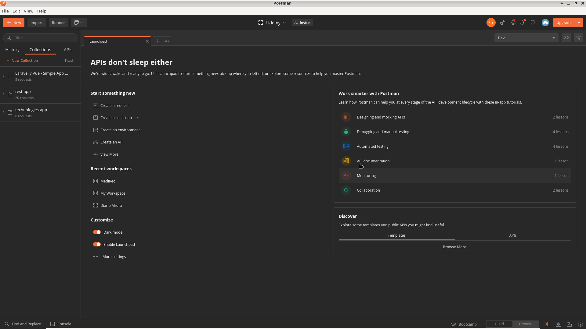

2. Importar el archivo de configuración del entorno (environment) desde la carpeta .postman,
el archivo se llama 'USUARIOS_API - Environment.postman_environment.json'.

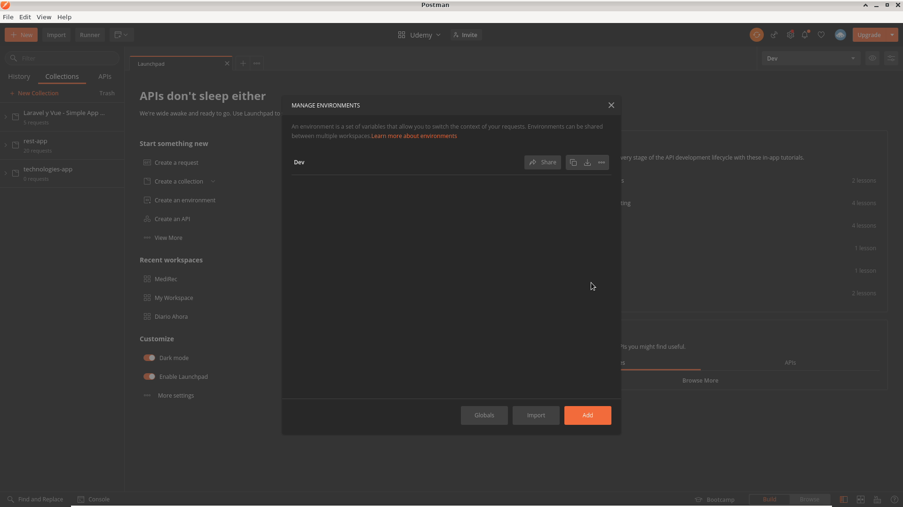

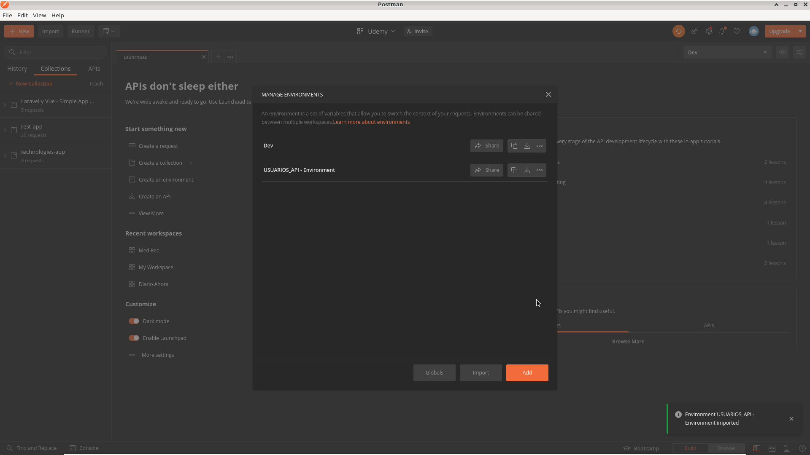

2. Importar el archivo que contiene la collección desde la carpeta .postman,
el archivo se llama 'USUARIOS_API.postman_collection'.

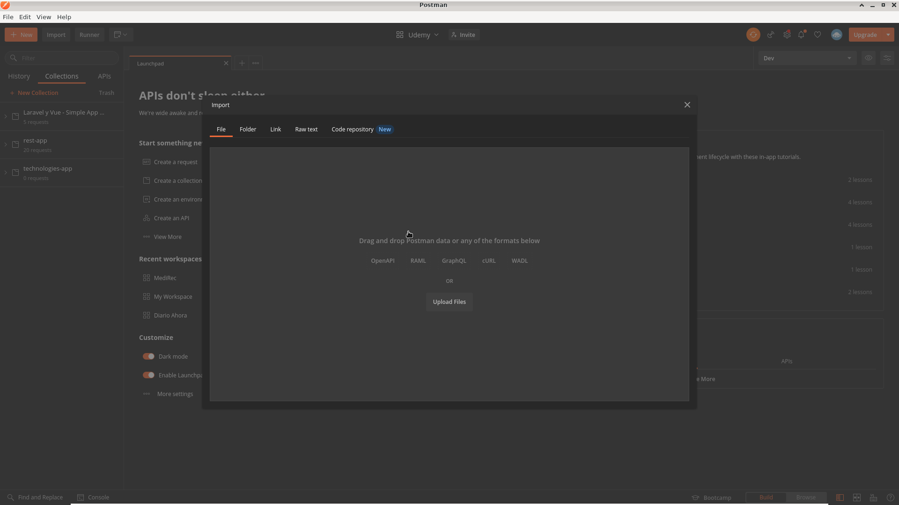

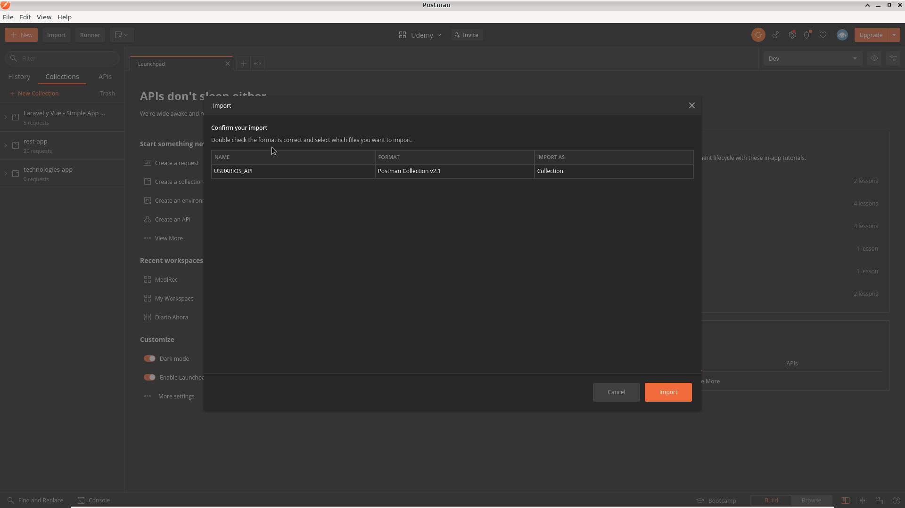

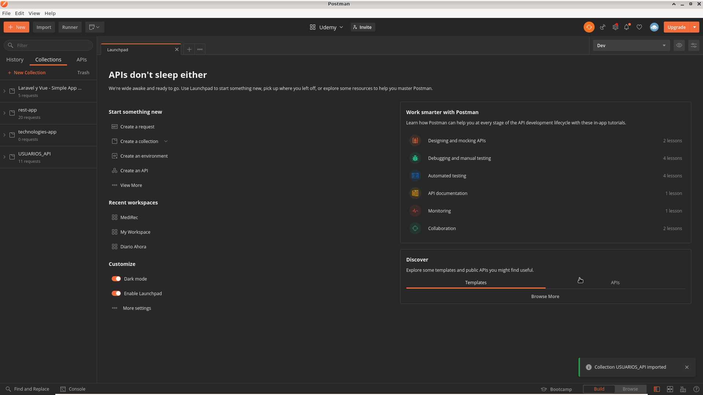

## Testing

### Accediendo a la API desde el Navegador

1. Navega al proyecto en tu navegador, escribiendo en el navegador la siguiente dirección: 

`localhost:8000`

2. Podrá ver la pantalla de la API.

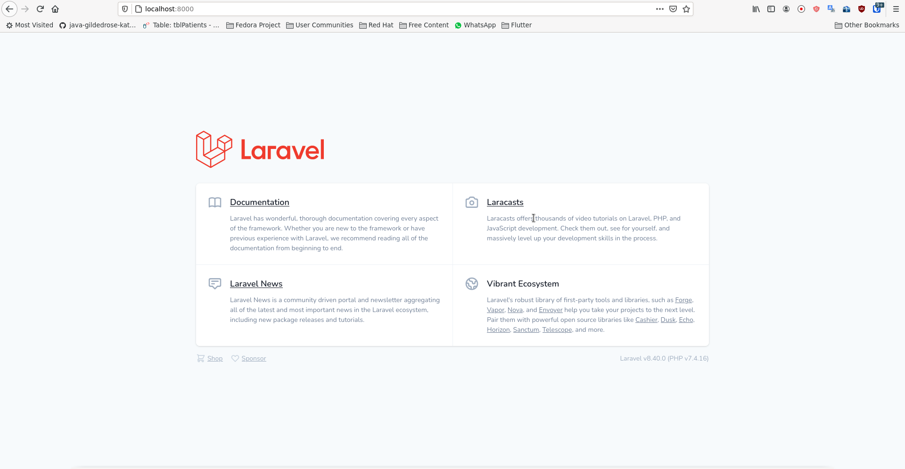

### Accediendo a la base de datos desde Adminer

1. Navega al proyecto en tu navegador, escribiendo en el navegador la siguiente dirección: 

`localhost:8001`

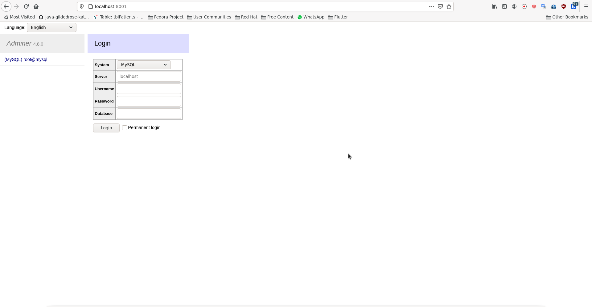

2. Las credenciales para acceder son las del archivo .env.

`Server=mysql`
`Username=root`
`Password=X9qbZRPn9iLZvy`

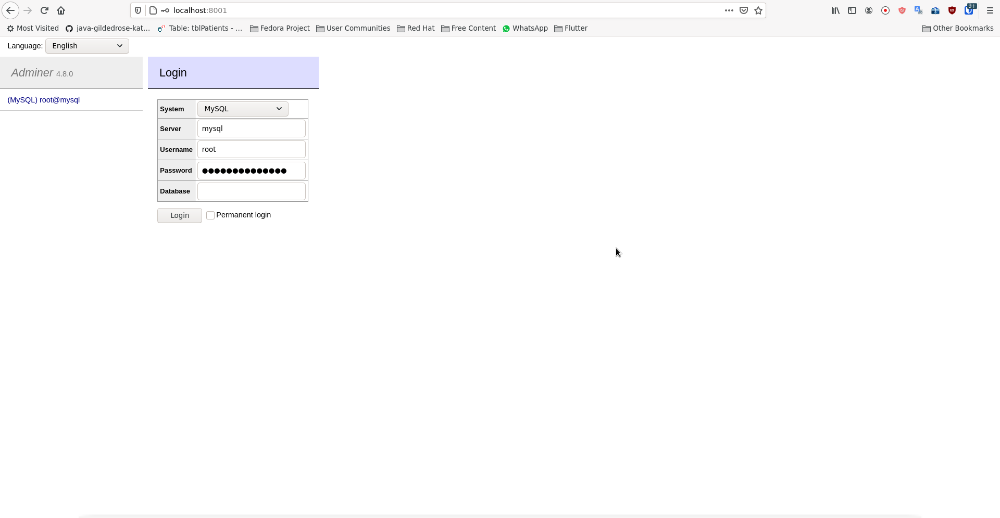

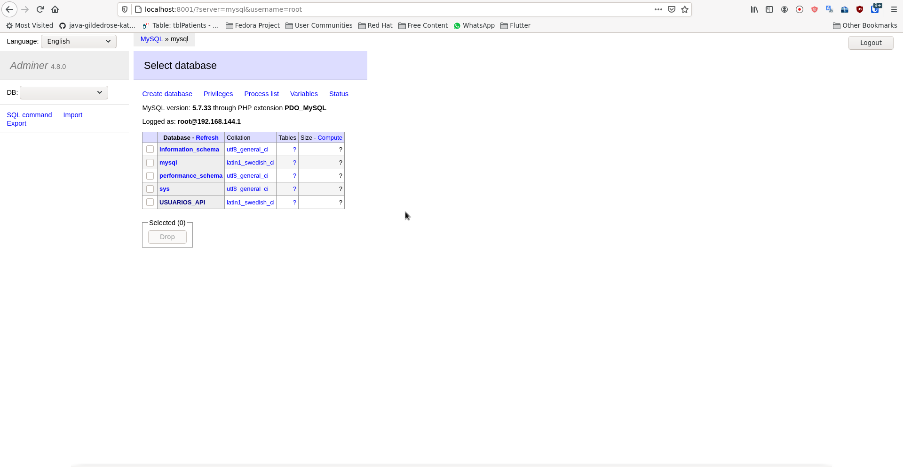

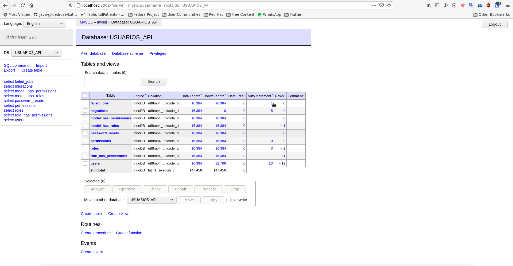

## 🚀 Desinstalar

La desintalación consiste en detener y remover: contenedores y volumenes usados para el servicio de la API.

1. Ejecutar en la consola: 

`sh ./.scripts/remove.sh`

2. Escribir `yes` y presionar `Enter` para confirmar la desintalación. 

## Author

👤 **Heimys Alvarado**

<!-- TODO: Corregir el correo * -->

- Email: [heimys@gmail.com](mailto:heimys@gmail.com)
- Twitter: [@HeimysAlvarado](https://twitter.com/HeimysAlvarado)
- Github: [@ing-halvarado-7s](https://github.com/ing-halvarado-7s)

## 🤝 Contribuciones

Se agradecen las contribuciones, los problemas y las solicitudes de funciones. 
Siéntete libre de comprobar [issues page](https://github.com/ing-halvarado-7s/ing-halvarado-7s-apiCRUDusuario/issues) si quieres contribuir. 

## 📝 Licencia

Copyright © 2021 [Heimys Alvarado](https://github.com/ing-halvarado-7s). 
Este proyecto es [MIT](https://github.com/kefranabg/readme-md-generator/blob/master/LICENSE) con licencia.

---

_Este README se generó con ❤️ por [readme-md-generator](https://github.com/kefranabg/readme-md-generator)_